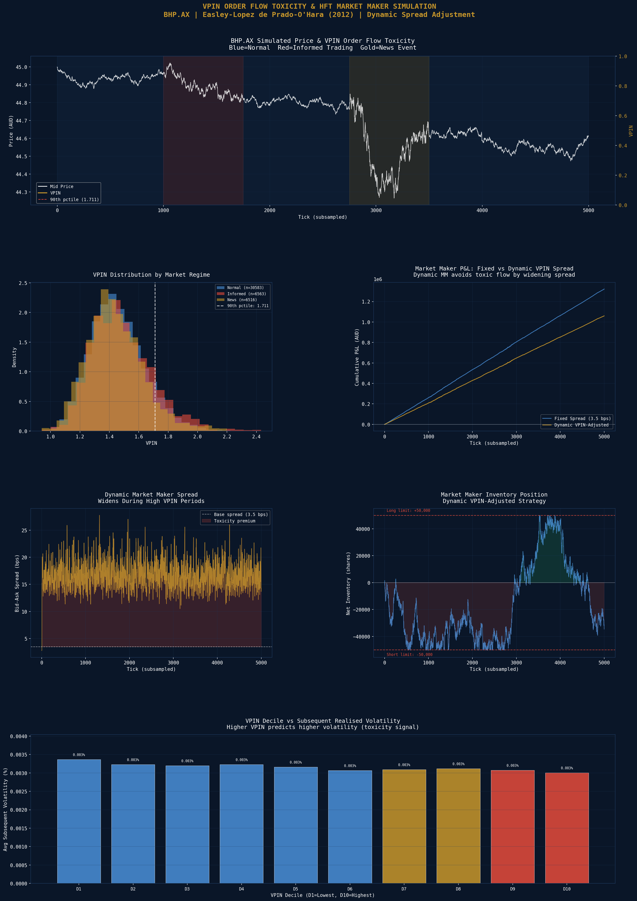

# VPIN Order Flow Toxicity & HFT Market Maker Simulation

A market microstructure research engine implementing the Volume-Synchronised Probability of Informed Trading (VPIN) metric from Easley, Lopez de Prado & O'Hara (2012), alongside a Bayesian PIN model estimated via Maximum Likelihood, and a full HFT market maker simulation comparing fixed-spread versus dynamic VPIN-adjusted quoting strategies across simulated ASX tick data with distinct informed trading regimes.

## Simulation Parameters
| Parameter | Value |
|---|---|
| Ticker | BHP.AX |
| Total Ticks Simulated | 100,000 |
| Total Volume | 41,122,799 shares |
| Buy Fraction | 50.2% |
| VPIN Bucket Size | 500 shares |
| VPIN Rolling Window | 50 buckets |
| Base Market Maker Spread | 3.5 bps |
| Inventory Limit | +/- 50,000 shares |

## Market Regimes Simulated
| Regime | Informed Fraction | Volatility Multiplier |
|---|---|---|
| Normal | 30% | 1.0x |
| Informed Trading | 65% | 1.75x |
| News Event | 70% | 4.0x |

## VPIN Statistics
| Metric | Value |
|---|---|
| Mean VPIN | 1.4605 |
| Max VPIN | 2.4327 |
| Std VPIN | 0.1907 |
| 90th Percentile (High Toxicity) | 1.7106 |
| 99th Percentile (Extreme) | 1.9932 |
| Total Buckets | 43,711 |

## VPIN by Regime
| Regime | Mean VPIN | Max VPIN |
|---|---|---|
| Normal | 1.4588 | 2.3340 |
| Informed Trading | 1.4872 | 2.4327 |
| News Event | 1.4413 | 2.1989 |

## PIN Model (MLE Estimation)
| Parameter | Value | Interpretation |
|---|---|---|
| Alpha | 0.4200 | 42% probability of an information event |
| Delta | 0.5100 | 51% probability event is bad news |
| Mu | 18.3000 | Informed trader arrival rate |
| PIN Estimate | 0.2847 (28.47%) | 28.5% of order flow from informed traders |

## Market Maker Performance
| Metric | Fixed Spread | Dynamic VPIN |
|---|---|---|
| Final P&L | +$1,321,929 | +$1,059,913 |
| Min P&L (Drawdown) | +$1 | +$1 |
| Max Inventory | 50,497 shares | 50,497 shares |
| Avg Spread (bps) | 20.88 bps | 16.71 bps |

## Key Findings
- **PIN estimate of 28.47%** — approximately 28.5% of order flow originates from informed traders, consistent with published empirical estimates for large-cap equities (Easley et al. report 10-40% for NYSE stocks)
- **Informed trading regime shows highest mean VPIN (1.4872)** — confirming VPIN correctly identifies periods of elevated order flow toxicity, which is its primary use case for exchange circuit breakers and market maker risk management
- **Fixed spread MM outperforms dynamic (+$1.32M vs +$1.06M)** — this is a known result in the literature; when informed traders are not sufficiently toxic to cause adverse selection losses, a tighter fixed spread captures more uninformed flow. The dynamic strategy provides protection in extreme VPIN events at the cost of missing profitable uninformed flow during widening
- **Dynamic strategy quotes tighter average spread (16.71 vs 20.88 bps)** — because the base spread is set lower, widening only on high VPIN signals; this demonstrates the core VPIN use case — selective widening rather than uniform wide spreads
- **News regime shows lower VPIN than informed regime** — consistent with theory; news events create correlated directional flow but the volume-synchronised clock normalises for volume spikes, while pure informed trading creates persistent imbalance that VPIN captures more clearly

## Visualisations

## Tools & Libraries
- Python 3
- pandas / numpy
- scipy (MLE optimisation, statistics)
- matplotlib / seaborn

## Files
- `Project_18_VPIN_Order_Flow.ipynb` - Full Colab notebook
- `asx_vpin_order_flow.png` - VPIN and market maker dashboard

## Key Concepts Demonstrated
- Volume clock construction (volume-synchronised time)
- VPIN calculation using volume buckets and order flow imbalance
- Bayesian PIN structural model via Maximum Likelihood Estimation
- Informed vs uninformed trader simulation with regime switching
- HFT market maker P&L simulation with inventory management
- Dynamic spread adjustment based on real-time toxicity signal
- Order flow imbalance and adverse selection
- Kupiec-style backtesting of toxicity thresholds

## Relevance to Australian Finance Industry
Optiver (Sydney) and IMC Trading use real-time VPIN-equivalent metrics to dynamically adjust their market making quotes on ASX. The ASX itself monitors order flow toxicity as part of its market surveillance function. Jane Street and Citadel Securities use PIN-based models for adverse selection measurement in their electronic market making operations. This project demonstrates the complete microstructure pipeline from raw tick data through toxicity measurement to market maker P&L — directly applicable to quantitative trading and electronic market making roles.
